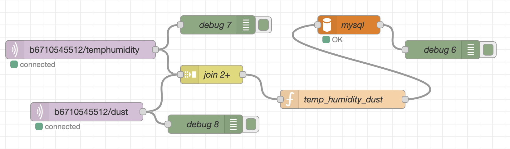
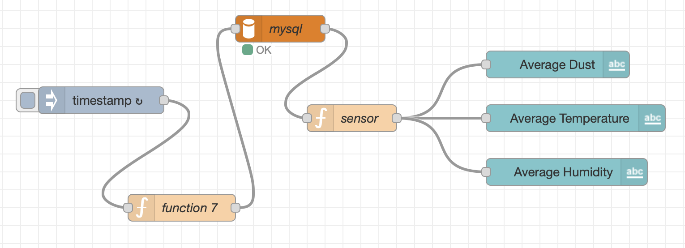
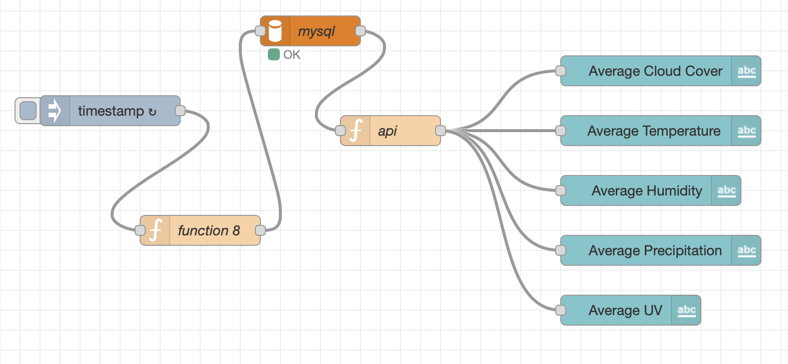
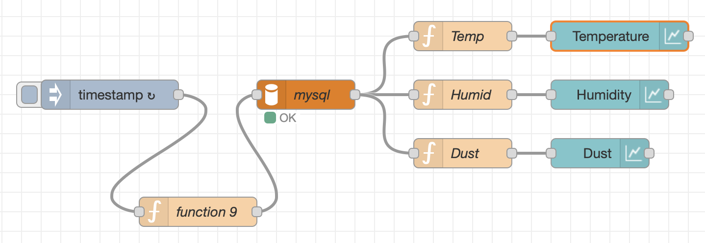
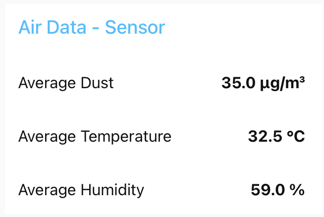
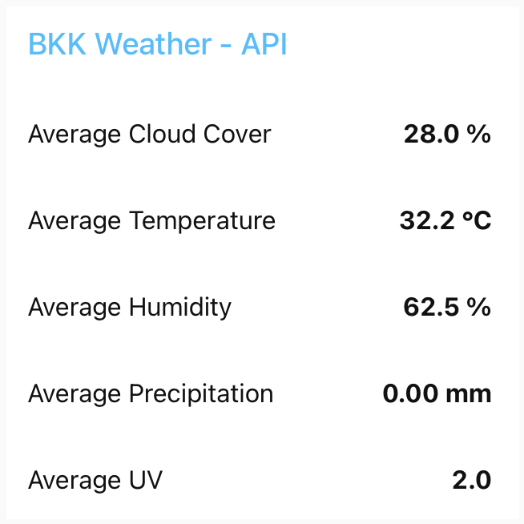
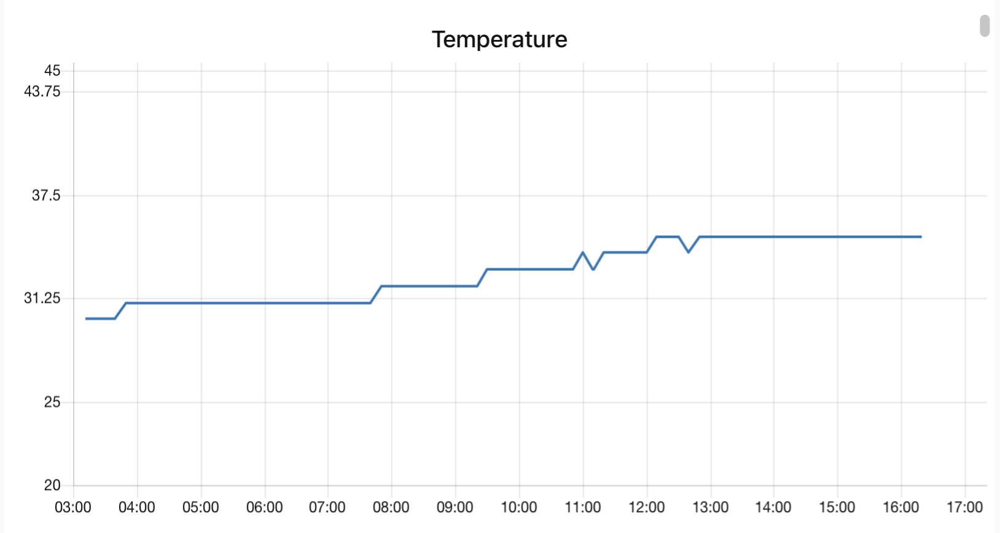
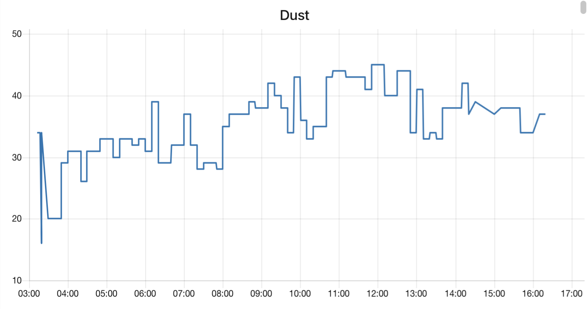
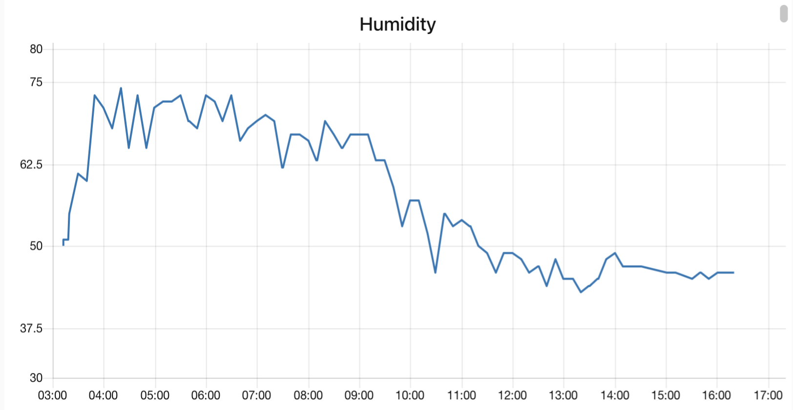

# DAQ_PhumPhaeKrungThep

## Overview
Nowadays, Bangkok is facing serious pollution and the effects of global warming. As a tropical country, Thailand is becoming hotter than ever, and the climate is increasingly unpredictable, with frequent rain and storms. People still need to go outside for work and education. However, since the COVID-19 pandemic, many people have adapted to studying online and working from home to avoid infection. These changes raise the question of whether environmental conditions influence people's decisions to stay indoors or go outside.

This project aims to monitor environmental factors such as dust, temperature, and humidity, and analyze how these factors may affect people’s behavior in terms of leaving their homes for studying, or working. By collecting and analyzing environmental data, the project seeks to understand whether environmental conditions play a significant role in people’s daily mobility and activities.

## Team Members
- Chanunchida Dithakumarn 6710545512
- Nattanan Pimjaipong 6710545601

## Objectives
- Collecting people decision to going outside and weather data such as temperature, humidity, and PM2.5.
- Analyze and summerize collected data for easyier understanding.
- Showing the data of people going of outside and weather condition.

## Features
- Historical data visulization of temperature, humidity, and dust (PM2.5) trends.
- Monitoring and summerizing temperature, humidity, and dust (PM2.5) data into average value.

## Primary Data Source
1. IOT sensor data

    - Temperature and humidity sensor (KY-015)
    - Dust Sensor (PMS7003)

2. Survey

## Secondary Data Source
- Thai Meteorological Department (https://www.tmd.go.th/service/serviceData)
- Air Quality Programmatic APIs (https://aqicn.org/api/)

### Tools
- Kidbright - MicroPython Board
- MQTTX
- Database - phpMyAdmin
- Node-RED
- Thonny / IDE - run Kidbright code

## Set up

### Database - phpMyAdmin
1. Import air_data.aql and bkk_weather.sql into you database
### Node-red
1. Install palette node-red-dashboard.
2. Import Node-red_flows.json (from Node-red folder) into Node-RED

    
    
    

    You should get this in the same file.

3. Change mqtt in node into your mqtt topics and change mysql node into your sql database. And you can see the dashboard.

4. You can see data visualization in line chart by import visualization.json into Node-RED

    

    Change mysql node to your setting

### Dashboard

 ### Data Visualization

 
 
 

## Presentation
- [Video Presentation](https://youtu.be/0b2Rwhaa7Ps?si=AzRDtgcdVQy9jwtU)